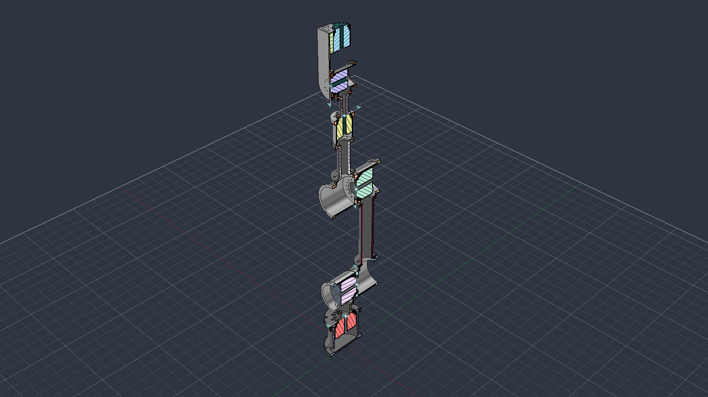

# Robot_to_URDF_New_Pakka — Robot Description



## Overview

| Property | Value |
|----------|-------|
| Total mass | 33.691 kg |
| Links | 6 |
| Joints | 5 (5 movable) |
| Assemblies | 5 |
| Root link | `base_link` |

## Table of Contents

- [Kinematic Tree](#kinematic-tree)
- [Link Properties](#link-properties)
- [Joint Properties](#joint-properties)
- [Assembly Breakdown](#assembly-breakdown)
- [Quick Start (ROS 2)](#quick-start-ros-2)
- [Files](#files)

## Kinematic Tree

```
base_link
  └─ Revolute_1 [continuous]
    L110I_Shoulder [BAKE]
      └─ Revolute_2 [continuous]
        L110I_shoulder_2 [BAKE]
          └─ Revolute_3 [continuous]
            J2J3_Shoulder [BAKE]
              └─ Revolute_4 [continuous]
                Wrist_Motor [BAKE]
                  └─ Revolute_5 [continuous]
                    L70IE_Finger [BAKE]
```

## Link Properties

| Link | Mass (kg) | Material | Collision | Bodies |
|------|-----------|----------|-----------|--------|
| `J2J3_Shoulder` | 3.4466 | Steel | box | 1 |
| `L110I_Shoulder` | 6.6253 | Steel | box | 4 |
| `L110I_shoulder_2` | 9.2677 | Steel | box | 4 |
| `L70IE_Finger` | 1.7141 | Stainless_Steel_304 | box | 5 |
| `Wrist_Motor` | 2.1096 | Stainless_Steel_304 | box | 5 |
| `base_link` | 10.5280 | Steel | cylinder | 4 |

## Joint Properties

| Joint | Type | Parent → Child | Axis | Limits |
|-------|------|---------------|------|--------|
| `Revolute_1` | continuous | `base_link` → `L110I_Shoulder` | (0,1,-0) | — |
| `Revolute_2` | continuous | `L110I_Shoulder` → `L110I_shoulder_2` | (0,-0,1) | — |
| `Revolute_3` | continuous | `L110I_shoulder_2` → `J2J3_Shoulder` | (-1,0,-0) | — |
| `Revolute_4` | continuous | `J2J3_Shoulder` → `Wrist_Motor` | (-0,0,1) | — |
| `Revolute_5` | continuous | `Wrist_Motor` → `L70IE_Finger` | (-0,0,1) | — |

## Assembly Breakdown

### J2J3_Joint_connecter_Idea

- **Links**: 
- **Total mass**: 0.000 kg

### J2J3_Joint_connecter_Idea_1

- **Links**: 
- **Total mass**: 0.000 kg

### J3J4_Elbow

- **Links**: J2J3_Shoulder
- **Total mass**: 3.447 kg

### J6_holder

- **Links**: L70IE_Finger
- **Total mass**: 1.714 kg

### Robot_Assembly_URDF_New

- **Links**: base_link, L110I_Shoulder, L110I_shoulder_2, Wrist_Motor
- **Total mass**: 28.531 kg

## Quick Start (ROS 2)

```bash
# 1. Copy package to your ROS 2 workspace
cp -r Robot_to_URDF_New_Pakka_description ~/ros2_ws/src/

# 2. Build
cd ~/ros2_ws
colcon build --packages-select Robot_to_URDF_New_Pakka_description
source install/setup.bash

# 3. Visualize in RViz2
ros2 launch Robot_to_URDF_New_Pakka_description display.launch.py

# 4. Validate URDF structure
check_urdf install/Robot_to_URDF_New_Pakka_description/share/Robot_to_URDF_New_Pakka_description/urdf/Robot_to_URDF_New_Pakka.urdf

# 5. Print kinematic tree
urdf_to_graphviz install/Robot_to_URDF_New_Pakka_description/share/Robot_to_URDF_New_Pakka_description/urdf/Robot_to_URDF_New_Pakka.urdf
```

**Joint control**: The launch file includes `joint_state_publisher_gui` —
use the sliders to move revolute/prismatic joints in RViz2.

**Topic inspection**:
```bash
# See published joint states
ros2 topic echo /joint_states

# See robot description parameter
ros2 param get /robot_state_publisher robot_description
```

## Files

| Path | Description |
|------|-------------|
| `urdf/Robot_to_URDF_New_Pakka.urdf.xacro` | Top-level xacro (entry point) |
| `urdf/Robot_to_URDF_New_Pakka.urdf` | Flat URDF (for validation) |
| `urdf/assemblies/` | Per-assembly xacro macros |
| `meshes/` | Visual (OBJ) and collision (STL) meshes |
| `launch/display.launch.py` | Launch robot_state_publisher, RViz, and generated controllers |
| `config/joint_state.yaml` | Joint state publisher config |
| `config/ros2_controllers.yaml` | Generated ros2_control controller manager config |
| `robot_data.yaml` | Supplementary data (beyond URDF) |
| `docs/transforms.md` | Transformation matrices (KaTeX) |

## Customizing

Assemblies tagged `!dummy_` are designed to be swapped out. To replace one:

1. Create your replacement as a xacro macro with the same interface
2. Place it in `urdf/assemblies/`
3. Update the `<xacro:include>` in `urdf/Robot_to_URDF_New_Pakka.urdf.xacro`
4. Update meshes in `meshes/<your_assembly>/`

The xacro prefix system (`${prefix}`) ensures link names stay unique
when multiple instances of the same assembly are used.

---
*Generated by Fusion URDF/XACRO Exporter v3.0.0-TEST2*